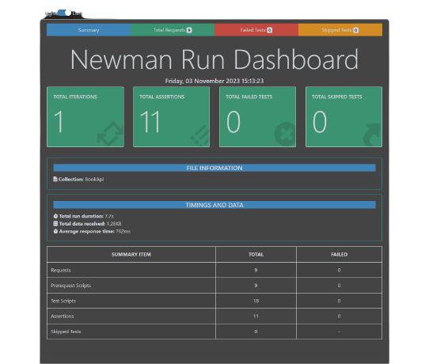

# Introduction
> This document explains how to run an API test with Postman on Book website.
# Summary

I completed an API test on the [Simple Books API](https://github.com/vdespa/introduction-to-postman-course/blob/main/simple-books-api.md). Here are the details of the tasks performed:

## Tasks Done

- Performed CRUD (Create, Get, Put, Delete) operations.
- Wrote Pre-request Scripts using Dynamic Parameters.
- Worked on API Request & Response Chaining.
- Wrote Test Scripts for Data Validation.
- Generated Newman HTML & HTML Extra Reports.

## Summary of Testing

In total, the following tasks were performed:

- **API Requests**: 9
- **Pre-request Scripts**: 9
- **Assertions**: 11
- **Test Scripts**: 18
- **Failed Tests**: 0
- **Skipped Tests**: 0
  
 
 

In this API, you can check status, API Authentication, List of books, Get a single book, Submit an order, Get all orders, Get an order,Update an order, Delete an order, check books are available or not.

For testing, you can access the [Simple Books API](https://github.com/vdespa/introduction-to-postman-course/blob/main/simple-books-api.md).

